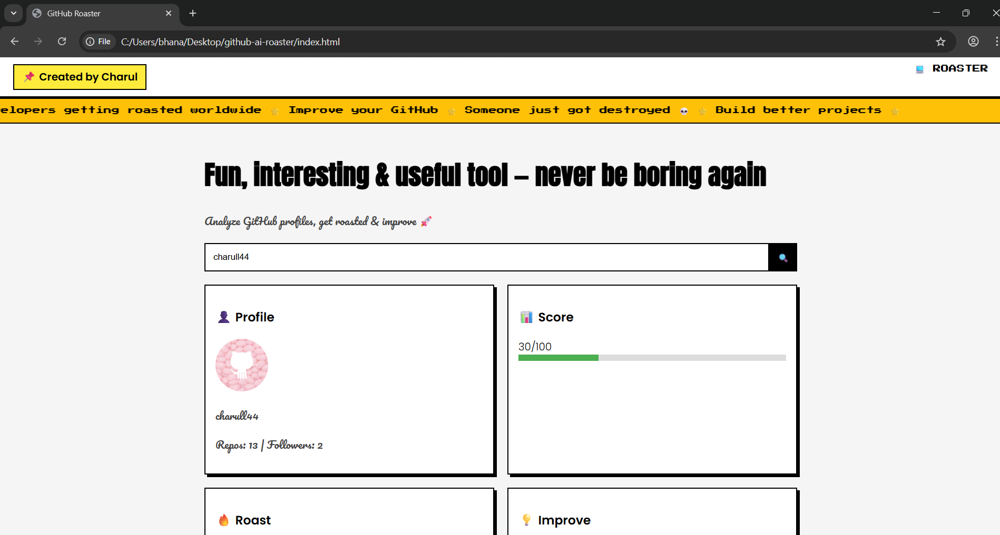

# 🎮 GitHub Roaster

### *Fun, Interesting & Useful Tool — Never Be Boring Again 😎*

  

---

## ✨ About the Project

🔥 GitHub Roaster is a fun + interactive tool that:

* Analyzes your GitHub profile
* Roasts you 😂
* Gives suggestions to improve 💡

👉 Built with a playful **bored.com-style UI** + modern features

---

## 🚀 Features

* 🔍 GitHub Profile Analyzer
* 😂 Funny Roast Generator
* 📊 Score System (0–100)
* 💡 Improvement Suggestions
* 🟡 Animated Scrolling Ticker
* 🎨 Retro + Modern UI (Pixel + Bold + Cursive Fonts)
* 📌 Personal Branding (Created by Charul)

---

## 📸 Preview

  

---

## 🛠️ Tech Stack

* HTML
* CSS
* JavaScript
* GitHub API

---

## 🚀 Live Demo
👉 [https://your-project-link.vercel.app](https://github-ai-roaster.vercel.app/)

---

## 💡 Future Improvements

* 🎲 Random GitHub User Generator
* 🏆 Leaderboard System
* 🧠 AI Roast Mode
* 📸 Shareable Roast Card

---

## 🤝 Contributing

Contributions are welcome!
Feel free to fork and improve 🔥

---

## 👨‍💻 Author

**Charul Bhanarkar**
📌 *Created with creativity & curiosity*

---

## ⭐ Show Your Support

If you like this project:

👉 Give it a ⭐ on GitHub
👉 Share it with your friends

---

  🚀 Keep Building • Keep Learning • Keep Growing

